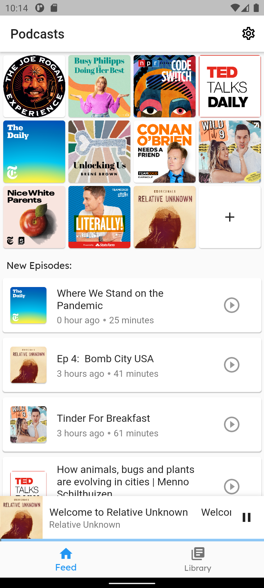
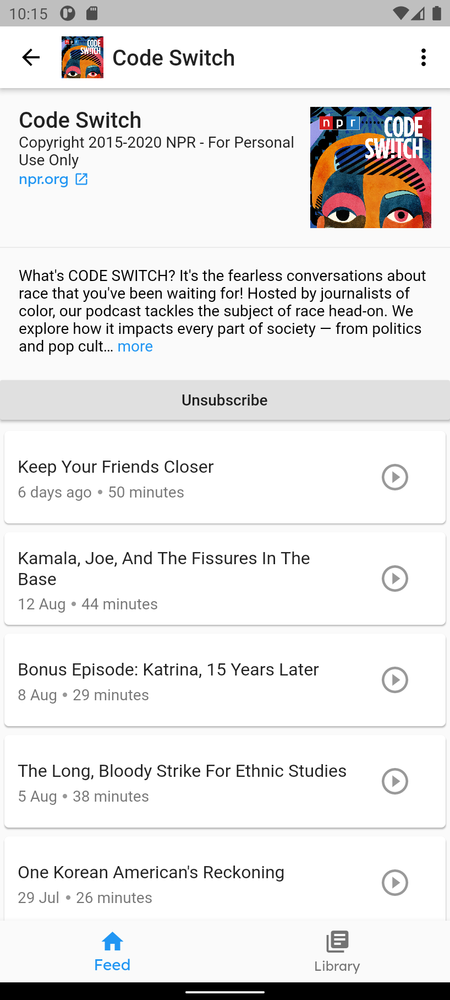
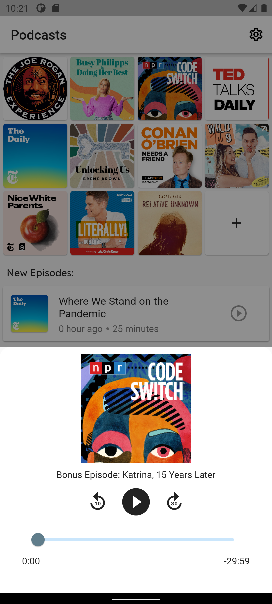
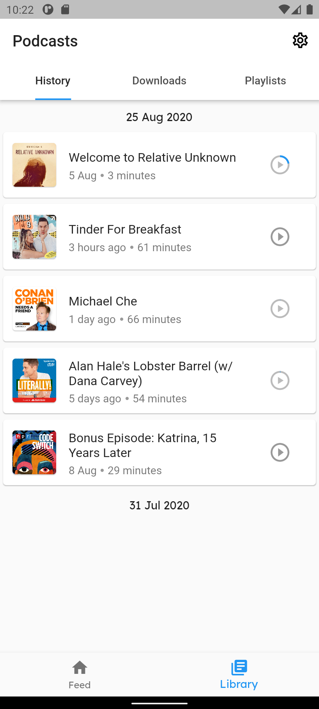

## PodcastProject

A **clean** and **intuitive** podcast player made with flutter.
The app processes everything locally on the device and ensures full **privacy**. 

  
  
  
  

> _The podcasts displayed in the preview are taken from the US podcast charts and do not reflect the author's opinion._

### Usage
To add a podcast, tap the button with the plus icon and insert the RSS feed. 
In the next step, the app will automatically fetch the data and add the podcast 
to your subscriptions if valid. You can always unsubscribe from podcasts at any 
time later.

### Features
- [x] playback history
- [x] download episodes
- [x] playlist support
- [x] ensures privacy through on-device processing
- [x] clean and modern interface
- [x] clear notification layout
- [x] RSS support

### Roadmap
- [ ] IOS redesign and support
- [ ] desktop and web support
- [ ] add advanced audio options such as transcript support and changing playback speed
